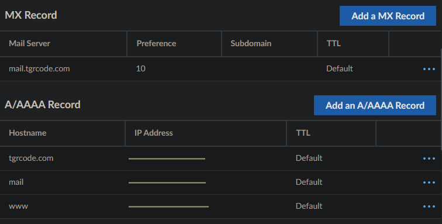
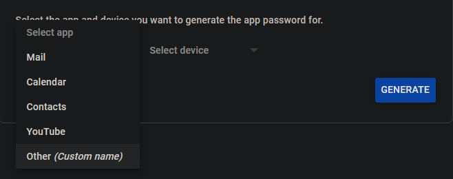
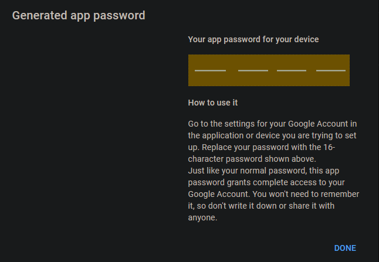
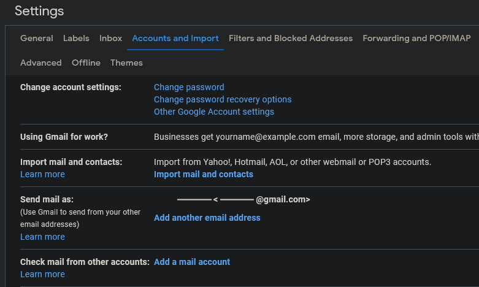
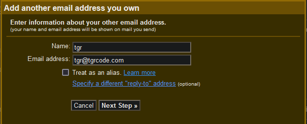
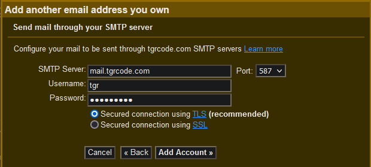
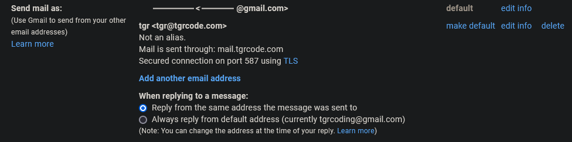
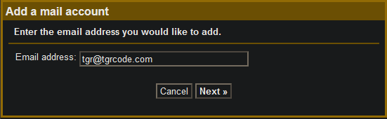
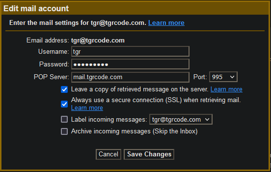
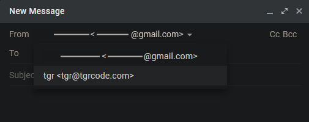

# SimpleMailserver
A script to facilitate easy installation of a Postfix + Gmail relay for custom emails you can easily access from the gmail client or other clients supporting SMTPS and POP3

# Before installing
1. Some ports must be exposed to be able to host a mailserver, and to prevent abuse most registrars disable these ports by default. Contact support to have them opened:
   * 25: SMTP
   * 110: POP3
   * 143: IMAP
   * 465: SMTPS
   * 587: Submission
   * 993: Secure IMAP
   * 995: Secure POP3
2. Certain DNS records must be added, namely MX and AAAA. MX must contain the mail.domain.com domain and AAAA must contain the mail subdomain

2. Generate an app password at [https://myaccount.google.com/apppasswords](https://myaccount.google.com/apppasswords)
3. Select `Other (Custom name)` and enter a distinctive identifier, like `Mailserver mail.domain.com`

4. Select generate and keep this app password for installation. You will not be able to see it again so make sure to record it somewhere


# Installing
Run the following command to install
```shell
su - -c "bash <(curl -fsSL https://raw.githubusercontent.com/TheGreatRambler/SimpleMailserver/main/install.sh)"
```
The installation script will ask for some values:
* Domain name: Domain name used in the email, also required to configure SSL
* Mail subdomain: Subdomain where actual mailserver will be hosted, it is good practice to not put the mailserver at root
* Admin user: User where administrator mail like webmaster,postmaster etc will be sent
* Certbot email: Email where certbot, SSL, updates will be sent
* Gmail email: Email required to authenticate with the Gmail relay
* App password: Google app password under previous gmail that identifies this server to Google

# After installation
Your new mailserver is most useful when paired with a email client supporting SMTPS and POP3. Gmail has been tested to work but other clients likely work
1. Open `See all settings` on Gmail and navigate to `Accounts and import`

2. Click `Add another email address` and fill out the form. Uncheck `Treat as an alias`

3. Configure using the desired user on the mailserver, like the admin user you entered earlier

4. SSH into your mailserver. Check the mail using `runuser -l user -c 'mail'` with the user you entered. Enter the number of the most recent email from `Gmail Team` and search for `Confirmation code: XXXXXXXXX` in the body of the email. Copy that code and enter it into the dialog on the Gmail client. Exit `mail` by pressing q twice and pressing Enter.
5. Disable `Always reply from default address`

6. Click `Check mail from other accounts` and enter your custom email

7. Enable `Import emails from my other account (POP3)`
8. Fill out the form, making special care to use port 995

9. You can now send email under your custom email


# Uninstalling
Run the following command to uninstall
```shell
su - -c "bash <(curl -fsSL https://raw.githubusercontent.com/TheGreatRambler/SimpleMailserver/main/uninstall.sh)"
```